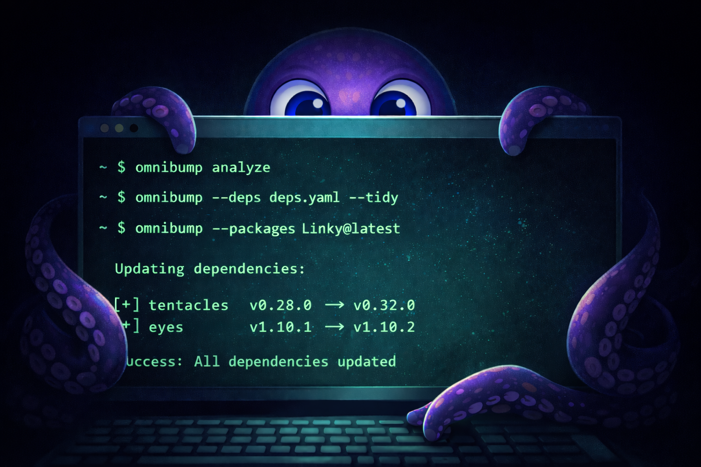

# omnibump



**Dependency version management tool**

`omnibump` is a CLI tool for updating dependency versions across multiple language ecosystems with an easy-to-use interface with automatic language detection.

## Features

- **Multi-Language Support**: Go, Rust, and Java (Maven, Gradle)
- **Automatic Detection**: Identifies project language automatically
- **Unified Configuration**: Single configuration format across all languages
- **Property-Based Updates**: Smart property management for Maven
- **Version Resolution**: Resolves `@latest` queries without spurious changes
- **Dependency Analysis**: Understand project's dependency structure
- **Dry Run Mode**: Preview changes before applying
- **Backward Compatible**: Works with legacy configuration file names

## Supported Languages

| Language | Build Tool | Manifest Files |
|----------|-----------|----------------|
| Go | Go Modules | `go.mod`, `go.sum` |
| Rust | Cargo | `Cargo.lock`, `Cargo.toml` |
| Java | Maven | `pom.xml` |
| Java | Gradle | `build.gradle`, `build.gradle.kts` |

## Installation

### From Source

```bash
git clone https://github.com/chainguard-dev/mono/omnibump
cd mono/omnibump
make build
sudo make install
```

### Verify Installation

```bash
omnibump version
```

For detailed installation instructions including build targets and development setup, see the [Installation Guide](docs/installation.md).

## Quick Start

### 1. Analyze Your Project

Before updating dependencies, analyze your project to understand its structure:

```bash
# Analyze current directory
omnibump analyze

# Get recommendations for specific dependencies
omnibump analyze --packages "golang.org/x/sys@v0.28.0"
```

### 2. Update Dependencies

```bash
# Using configuration file
omnibump --deps deps.yaml

# Using inline packages
omnibump --packages "golang.org/x/sys@v0.28.0"

# Dry run first (recommended)
omnibump --deps deps.yaml --dry-run

# With automatic tidying
omnibump --deps deps.yaml --tidy
```

## Basic Usage

### Go Projects

```bash
# Update a single dependency
omnibump --language go --packages "golang.org/x/sys@latest" --tidy
```

Or create `deps.yaml`:

```yaml
packages:
  - name: golang.org/x/sys
    version: v0.28.0
  - name: golang.org/x/crypto
    version: v0.31.0
```

Run update:

```bash
omnibump --deps deps.yaml --tidy
```

### Rust Projects

Create `deps.yaml`:

```yaml
packages:
  - name: tokio
    version: 1.42.0
  - name: serde
    version: 1.0.217
```

Run update:

```bash
omnibump --deps deps.yaml
```

### Java (Maven) Projects

Create `deps.yaml`:

```yaml
packages:
  - groupId: io.netty
    artifactId: netty-codec-http
    version: 4.1.94.Final
  - groupId: junit
    artifactId: junit
    version: 4.13.2
    scope: test
```

Run update:

```bash
omnibump --deps deps.yaml
```

For properties-based updates:

```yaml
# properties.yaml
properties:
  - property: slf4j.version
    value: 2.0.16
```

```bash
omnibump --properties properties.yaml
```

### Java (Gradle) Projects

Create `deps.yaml`:

```yaml
packages:
  - name: "org.apache.commons:commons-lang3"
    version: "3.18.0"
  - name: "io.netty:netty-all"
    version: "4.1.101.Final"
```

Run update:

```bash
omnibump --deps deps.yaml
```

## Documentation

Comprehensive documentation is available in the `docs/` directory:

- **[Installation Guide](docs/installation.md)** - Detailed installation, build targets, and development setup
- **[Usage Examples](docs/usage-examples.md)** - Comprehensive examples for all supported languages
- **[Configuration Guide](docs/configuration.md)** - Configuration file formats and package specifications
- **[CLI Reference](docs/cli-reference.md)** - Complete command-line interface documentation
- **[Validation and Safety](docs/validation-and-safety.md)** - Built-in validation rules and safety features
- **[Common Workflows](docs/workflows.md)** - CVE response, batch updates, CI/CD integration
- **[Best Practices](docs/best-practices.md)** - Recommendations for using omnibump effectively
- **[Troubleshooting](docs/troubleshooting.md)** - Common issues and solutions
- **[Migration Guide](docs/migration-guide.md)** - Migrating from gobump, cargobump, or pombump
- **[Advanced Usage](docs/advanced-usage.md)** - Debug mode, automation, and advanced features

## FAQ

### Does omnibump support Gradle?

Yes! Gradle support is fully implemented. omnibump auto-detects Gradle projects and supports both Groovy DSL (`build.gradle`) and Kotlin DSL (`build.gradle.kts`). See the [Usage Examples](docs/usage-examples.md) for details.

### Can I use omnibump in CI/CD?

Yes! omnibump is designed for automation. Use `--dry-run` for validation and regular mode for updates. See the [Common Workflows](docs/workflows.md) guide for CI/CD integration examples.

### How does omnibump compare to Dependabot or Renovate?

omnibump is a CLI tool for manual/scripted updates. Dependabot and Renovate are automated services that create PRs. They serve different use cases and can complement each other.

### Is omnibump safe to use?

Yes, with proper testing. Always use `--dry-run` first, review changes, run tests, and maintain backups. See the [Validation and Safety](docs/validation-and-safety.md) guide for details on built-in safety features.

## Contributing

Contributions are welcome! Please see [CONTRIBUTING.md](CONTRIBUTING.md) for guidelines.

## License

Copyright 2026 Chainguard, Inc.

Licensed under the Apache License, Version 2.0. See [LICENSE](LICENSE) for details.

## Support

- **Issues**: https://github.com/chainguard-dev/omnibump/issues
- **Documentation**: https://github.com/chainguard-dev/omnibump/tree/main/docs
- **Discussions**: https://github.com/chainguard-dev/omnibump/discussions

## Related Tools

- **gobump**: Legacy Go-specific dependency updater (superseded by omnibump)
- **cargobump**: Legacy Rust-specific dependency updater (superseded by omnibump)
- **pombump**: Legacy Maven-specific dependency updater (superseded by omnibump)
- **Dependabot**: Automated dependency updates via GitHub
- **Renovate**: Automated dependency updates across platforms

---

Made with 💜 by [Chainguard](https://chainguard.dev)
